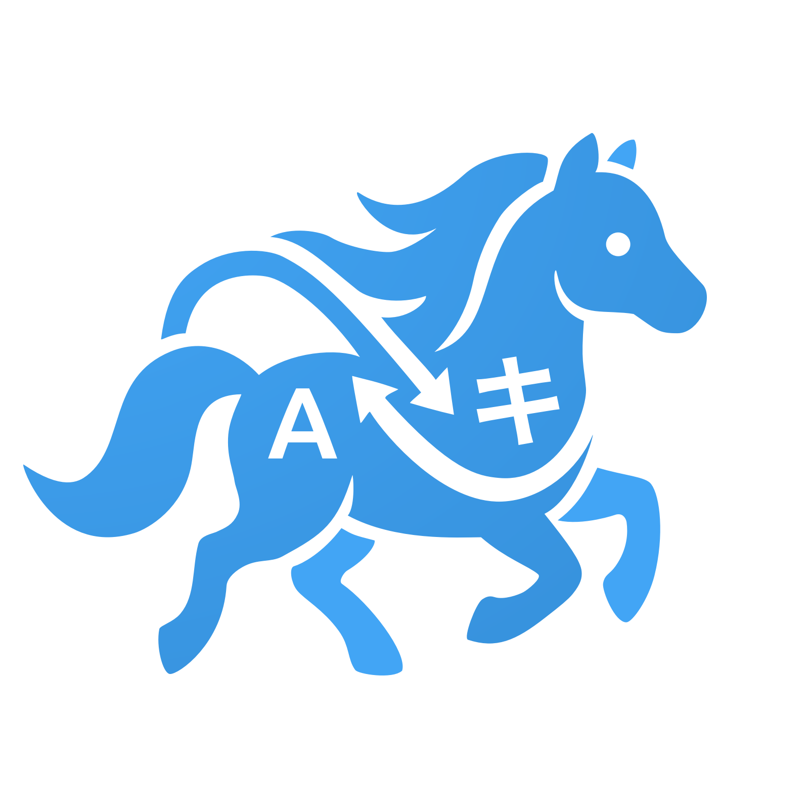

<div align="center">
   
   <br/>
   <a href="https://discord.gg/sSkysVtj7y"></a>
   <a href="https://www.patreon.com/JasminDreasond"></a>
   <a href="https://ko-fi.com/jasmindreasond"></a>

   [](https://github.com/Pony-Driland)
   [](https://twitter.com/JasminDreasond/)
   [](https://ud.me/jasmindreasond.x)
   [](https://www.blockchain.com/pt/btc/address/bc1qnk7upe44xrsll2tjhy5msg32zpnqxvyysyje2g)
</div>

# 🦄 Tiny Pony Translator

Welcome to the **Tiny Pony Translator**! This is a lightweight and modern translation tool built to give you total control over your translations. Whether you want to translate simple text, entire files, or complex JSON structures, we've got you covered! 

Designed to be highly flexible, it works seamlessly as a native Desktop Application (via Electron) or as a lightweight Web Application in your browser. 

## ✨ How It Works

At its core, Tiny Pony Translator connects to self-host backends to process your translations safely and efficiently:

* **LibreTranslate API:** You can connect to a remote LibreTranslate server (like `libretranslate.com`) or seamlessly install, manage, and run your own **Local LibreTranslate Instance** directly from the app (Desktop only).
* **OpenAI-Compatible API:** Connect to any LLM (Large Language Model) that supports the OpenAI API format (like LM Studio, Ollama, or standard OpenAI). It includes custom system prompts and a dedicated **Spell Checker Mode**.
* **Smart JSON Editor:** A specialized built-in tool to open, translate, edit, and save JSON files without breaking their internal structures.
* **Hybrid Architecture:** Built with React and Vite, the UI adapts perfectly whether you are running it inside the Electron sandbox or hosting it on a web server.

---

## 🚀 Getting Started

Before you begin, make sure you have [Node.js](https://nodejs.org/) installed on your machine. If you plan to run the Local LibreTranslate server on the Desktop app, you will also need Python installed.

### 1. Installation
Clone this repository and install the required dependencies:

```bash
git clone https://github.com/Pony-House/Tiny-Pony-Translator.git
cd Tiny-Pony-Translator
npm install
```

### 2. Development Mode
You can run the app in development mode to see changes in real-time.

**For Desktop (Electron):**
```bash
npm run dev
```

**For Web (Browser):**
```bash
npm run web:dev
```
*This will open a local server (usually on port 3000) so you can test the web UI.*

---

## 🛠️ Building the Project

When you are ready to distribute the app, you can compile it for different platforms.

### Building for Desktop (Electron)
Tiny Pony Translator uses `electron-builder` to create standalone executables for your operating system.

* **Build for Linux (AppImage & deb):**
    ```bash
    npm run build:linux
    ```
* **Build for Windows (exe):**
    ```bash
    npm run build:win
    ```
* **Build for macOS (dmg):**
    ```bash
    npm run build:mac
    ```

*Note: You will find your compiled executables inside the `dist` folder.*

### Building for the Web
To host the translator on a standard web server (like GitHub Pages, Vercel, or Apache/Nginx), you just need to build the React frontend:

```bash
npm run web:build
```
*This will generate a `dist-web` folder in the root directory. Simply upload the contents of this folder to your web server, and your Web App is ready to go!*

* **Privacy First:** Run everything 100% offline using your own local LibreTranslate environment or local LLMs.

---

## 💡 Credits

> 🧠 **Note**: This documentation was written by [Gemini](https://gemini.google.com), an AI assistant developed by Google, based on the project structure and descriptions provided by the repository author.  
> If you find any inaccuracies or need improvements, feel free to contribute or open an issue!

<div align="center">
<a href="https://github.com/Tiny-Essentials/Tiny-Essentials/tree/main/test/img"></a>

Made with tiny love! 🍮
</div>
